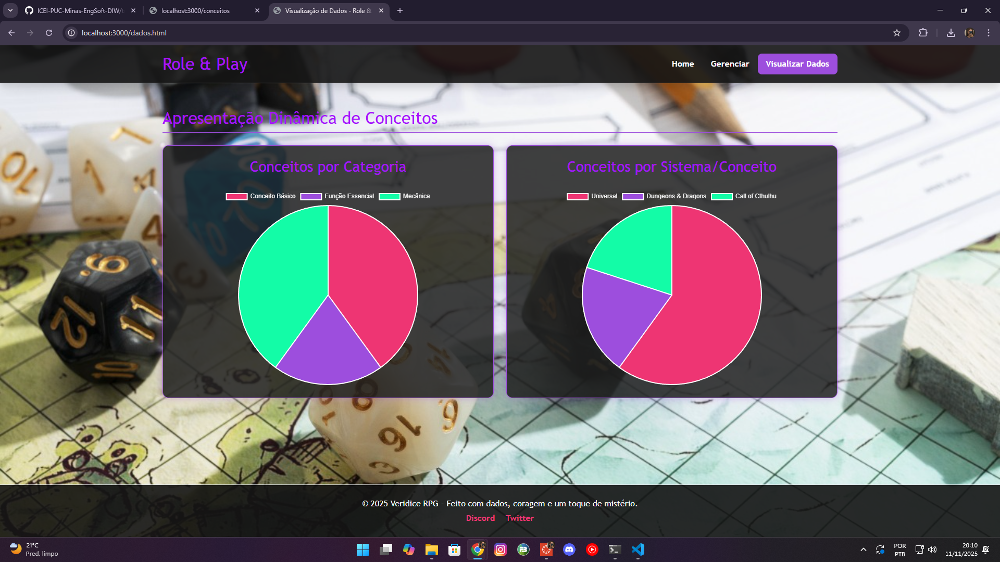
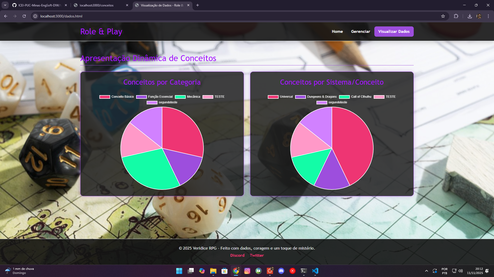
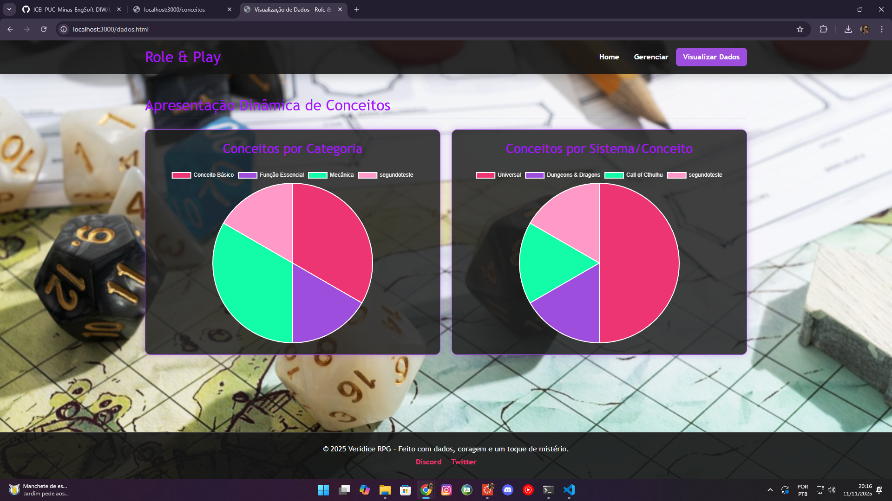

# Trabalho Prático 07 - Semanas 13 e 14

A partir dos dados cadastrados na etapa anterior, vamos trabalhar formas de apresentação que representem de forma clara e interativa as informações do seu projeto. Você poderá usar gráficos (barra, linha, pizza), mapas, calendários ou outras formas de visualização. Seu desafio é entregar uma página Web que organize, processe e exiba os dados de forma compreensível e esteticamente agradável.

Com base nos tipos de projetos escohidos, você deve propor **visualizações que estimulem a interpretação, agrupamento e exibição criativa dos dados**, trabalhando tanto a lógica quanto o design da aplicação.

Sugerimos o uso das seguintes ferramentas acessíveis: [FullCalendar](https://fullcalendar.io/), [Chart.js](https://www.chartjs.org/), [Mapbox](https://docs.mapbox.com/api/), para citar algumas.

## Informações do trabalho

- Nome: Anny Victorya Azevedo Oliveira
- Matricula: 899228
- Proposta de projeto escolhida:  Proposta 5
- Breve descrição sobre seu projeto: Projeto dedicado ao universo dos RPGs, trazendo dicas para mestres e jogadores, sistemas criativos, análises de jogos e inspirações para campanhas.

**Print da tela com a implementação**

<< Coloque aqui uma breve explicação da implementação feita nessa etapa>>

Para essa etapa, foi escolhido o Chart.js. Para testar a implementação, criei mais duas classificações para os testes, os quais fizeram com que a apresentação dos dados no gráfico de setores mudasse, adequando-se à nova situação (imagem 2).

<<  COLOQUE A IMAGEM TELA 1 AQUI >>

<<  COLOQUE A IMAGEM TELA 2 AQUI >>

